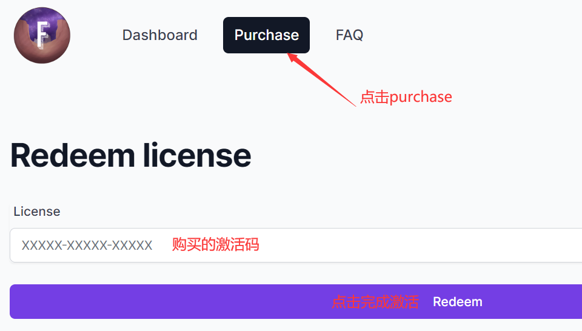
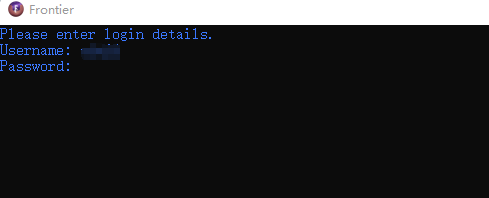

# 使用教程

点击链接注册[https://frontiercheats.com/dashboard/register](https://frontiercheats.com/dashboard/register)

.png>)

注册成功后点击链接登录[https://frontiercheats.com/dashboard/login](https://frontiercheats.com/dashboard/login)

.png>)

在售后群或官网下载安装器

进入故事模式后打开frontier.exe

username后面输入用户名

0.png)

回车后输入密码然后回车

等待10秒左右，期间不要动鼠标键盘,这时你游戏会卡顿

等待游戏卡顿结束后,菜单会自动呼出（此菜单没有后台黑框）

**`F4` 呼出/隐藏菜单**

**方向键`↑`  `↓` 或者 `8`  `2` 控制上下**

**方向键`←`  `→` 或者 `4`  `6` 控制左右**

**`回车/Ent/5` 确定； `退格键/Back/0` 返回**
