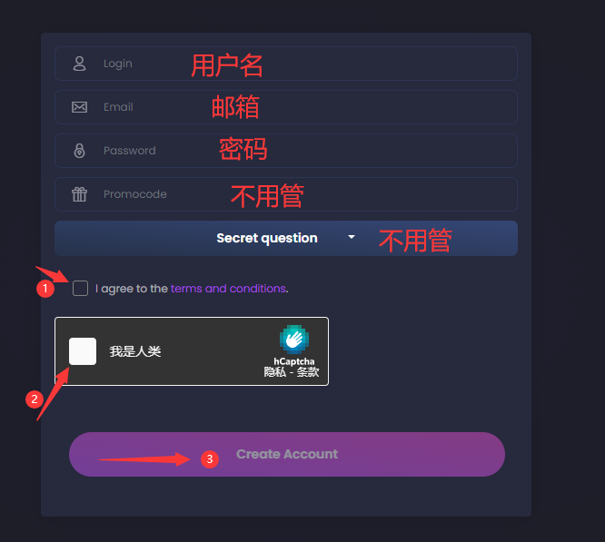
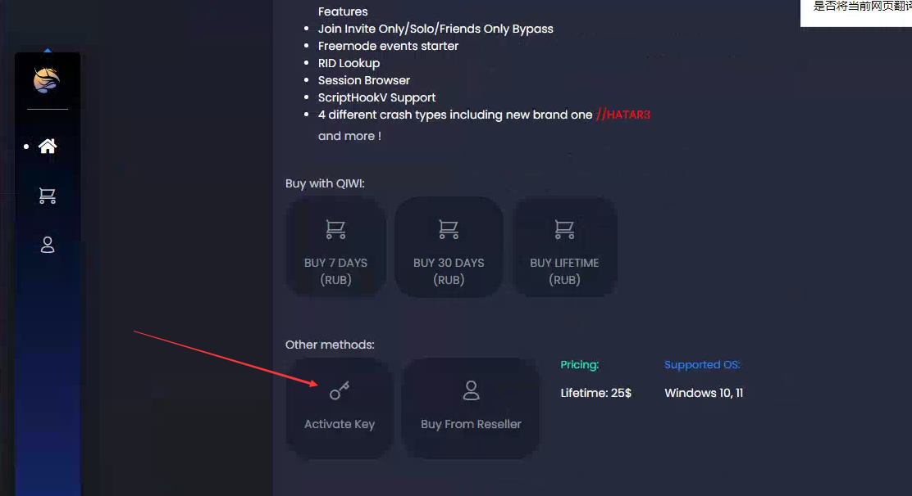

# 使用教程

注册：[https://nfcheats.com/register](https://nfcheats.com/register)

注册时请不要输入中文(及中文符号)

**注册完成后稍等几秒会跳转到登录界面，输入 账号、密码、完成 人机验证 后点 LOGIN 登录**

**激活**

售后群下载安装器，点击安装黄昏

.png>)

安装完成后出现下图，并输入账号密码登录

.png>)

**安装只需要一遍，除非你卸载了或者更换了电脑，否则下次只需要打开游戏注入菜单**

****.png>)****

出现下图即为成功

.png>)

**注入成功后**

**注入成功后**

**`F4/*` 呼出/隐藏菜单**

**方向键`↑`  `↓` 或者`8`  `2` 控制上下**

**方向键`←`  `→` 或者`4`  `6` 控制左右**

**`回车键/Ent/5` 确定； `退格键/Back/0` 返回**

## 中文设置

setting->translations->Chinese

