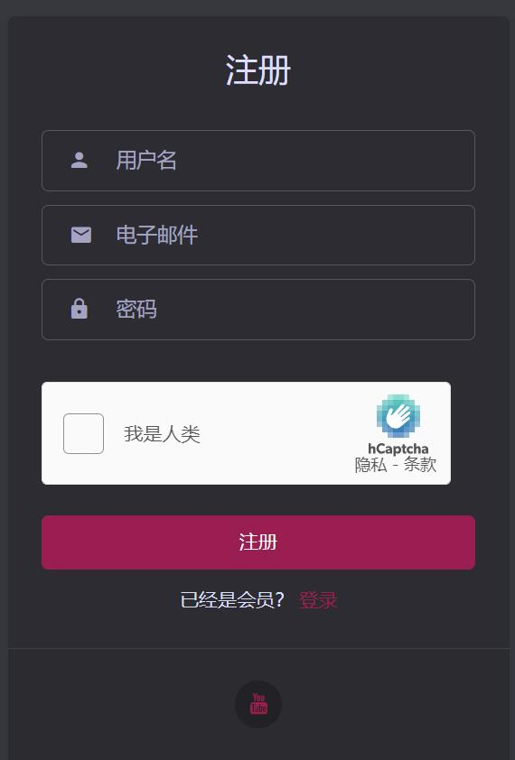
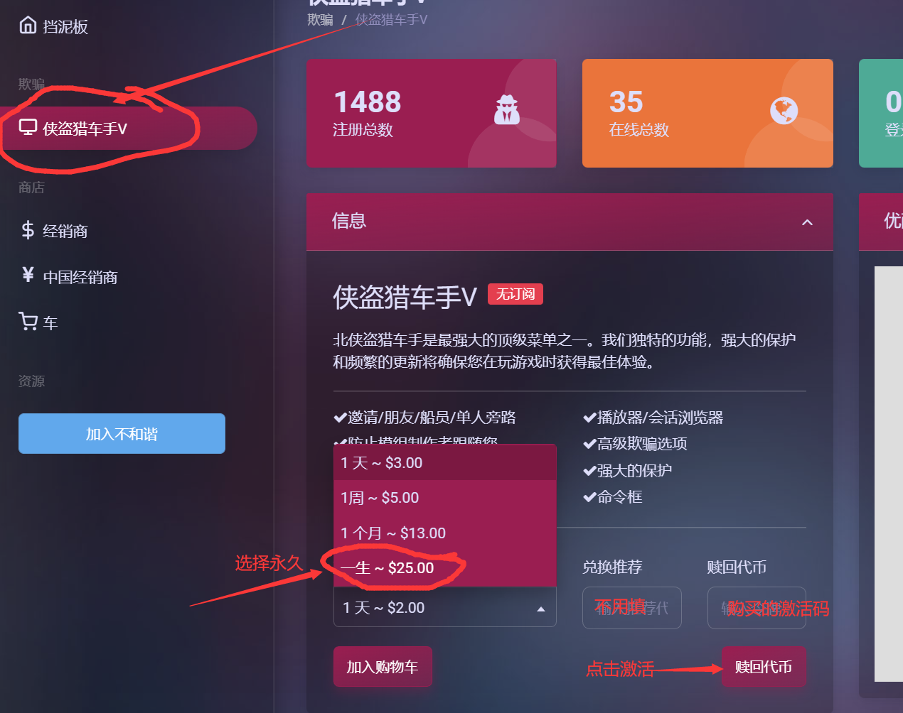

# 使用教程

访问注册链接[https://north.lol/sign-up.html](https://north.lol/sign-up.html)

按照下图要求输入信息，然后选择注册

注册成功后登录进去，如下图

在左侧选择gta5，<mark style="color:red;">**切记一定要在期限栏内选择永久！！**</mark>

之后输入激活码点击激活即可

**如若点击激活码后无反应,请刷新网页,刷新后看到左下角多了`Download Launcher` 代表激活成功**

**在售后群中下载安装器**

选择north栏目后点安装，进入故事模式后点击注入

出现下图后在username后面输入用户名回车后输入密码再回车

.png>)

出现下图后输入1回车即可

.png>)

等待下图注入完成

.png>)

以上在黑框中输入账号密码的操作只需要进行一次，之后进入故事模式后直接点击安装器中的注入按钮即可

**`F4` 呼出/隐藏菜单**

**方向键`↑`  `↓` 或者`8`  `2` 控制上下**

**方向键`←`  `→` 或者`4`  `6` 控制左右**

**`回车键/Ent/5` 确定； `退格键/Back/0` 返回**

**`F12`设置快捷键**

**`/`呼出命令框**

## **设置中文**

**Settings>Translations>选择chinese** **`回车键/Ent/5` 确定 即可**

## **纹理缺失**

如若出现纹理缺失就重新注入
