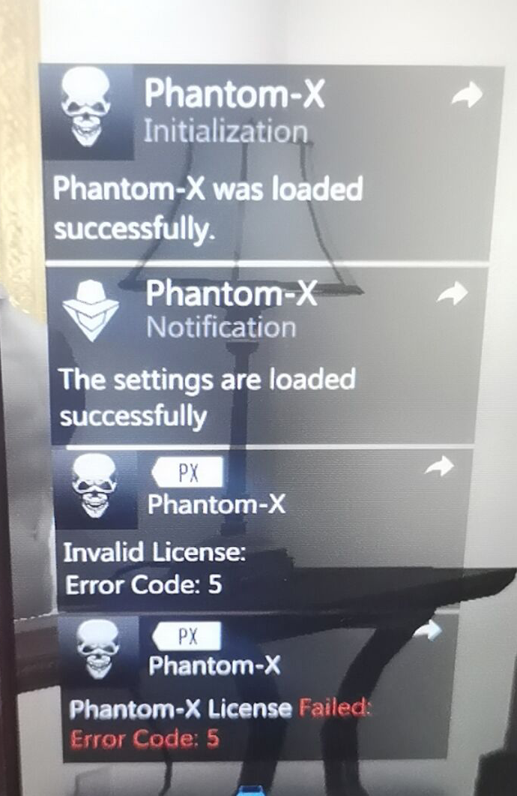

# 幻影刚注入时左下角提示解析

下图表示需要解绑，此时按下小键盘的9即可完成解绑并绑定新电脑，然后重新进游戏并注入即可

.png>)

下图为解绑间隙不足三天，只能等待距上次解绑三天后，无法解决

.png>)

下图为账号密码验证超时，需重新输入并重新安装

.png>)

下图为链接服务器失败，说明是用户的网络问题，建议更换加速器节点或换更好的加速器或者更换网络

.png>)

下图解决：

**重启你的路由器和电脑**

**禁止使用雷神以及免费加速器**

**UU加速`模式3`**

**迅游加速器`模式3/5`**

**奇游加速器`模式1/4`**

**更换加速器 更换加速器模式 更换加速器节点**

