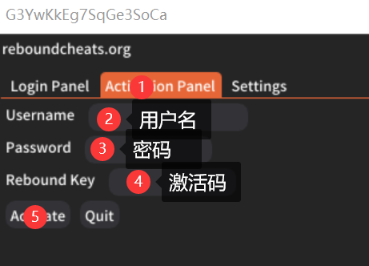

# 使用教程

官网注册：[https://reboundcheats.org/register/](https://reboundcheats.org/register/)

输入相关信息（日期成年的即可，位置选中国china）后点击注册

.png>)

注册完成后在售后群下载注入器，完全解压出来后右键管理员运行

.png>)

再返回login panel输入用户名密码后点login

然后进入游戏的故事模式后再按下图顺序操作

等待注入完成即可

**`F4/INS` 呼出/隐藏菜单**

**方向键`↑`  `↓` 或者`8`  `2` 控制上下**

**方向键`←`  `→` 或者`4`  `6` 控制左右**

**`回车键/Ent/5` 确定； `退格键/Back/0` 返回**

## **中文设置**

**先在售后群下载中文文件**

将其解压后放到如下路径：我的文档>>Rebound>>Translations文件夹内

**在游戏中呼出菜单后依次按：settings-translation-chinese确定即可**
