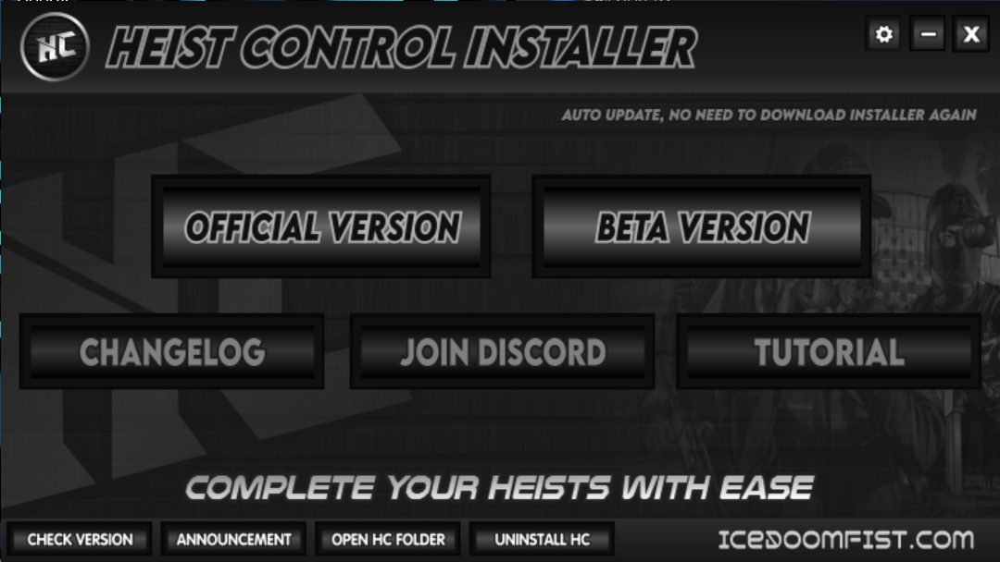

# stand添加lua

1.脚本后缀是lua形式的

先在安装器里面选择打开stand文件夹

然后打开lua scripts，将你不知从哪下载来的lua文件放到里面

注入stand后依次选择stand->lua脚本，在这里面启动脚本即可

2.hoist control安装器

打开heist control installer.exe

如下图点击official version后即可

游戏内操作：stand-lua脚本-heist control

