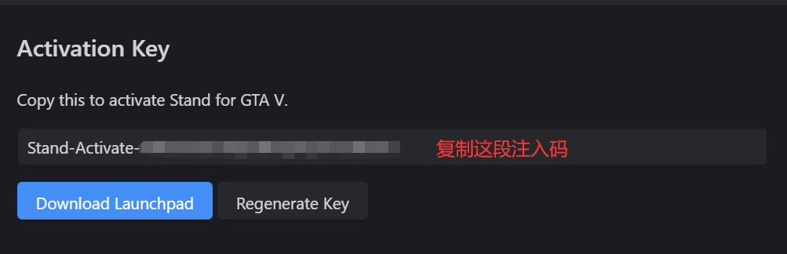

# 使用教程

点击链接进行注册[https://stand.gg/account/register](https://stand.gg/account/register)

以下使用的激活码是基础版的，若你购买的是别的版本将会得到基础版激活码和一个别的版本的升级码，

先使用基础版激活码进行初步激活

切记不要把升级码当作激活码在此使用

.png>)

.png>)

.png>)

至此你已完成最基本的激活，若你是基础版就跳过此升级链接直接进行安装注入

若你是常规版或终极版则点击下方升级链接教程进行升级，升级完成后再继续下方安装注入

## [stand版本升级](GTA5/stand/stand-ban-ben-sheng-ji.md)

## 安装注入

安装器合集

在售后群中下载安装器合集，在左边栏找到stand

在此粘贴刚刚复制的注入码

点击安装，进入故事模式后再点击注入

官方注入器

在售后群下载stand launchpad

然后进入到gta5故事模式

点击inject stand即可

有小键盘

**小键盘 `+`  呼出/隐藏菜单**

**小键盘`8`  `2` 控制选项上下**

**小键盘`4`  `6` 控制选项左右**

**小键盘`5` 确定； `0` 返回**

**小键盘`7` 上翻左边列表；`3` 下翻左边列表**

无小键盘

**`F4` 呼出/隐藏菜单**

**方向键`↑`  `↓` 控制选项上下**

**方向键`←`  `→` 控制选项左右**

**`回车/Ent` 确定； `退格键/Back` 返回**

**键盘右边的`Ctrl` 上翻左边列表；`Shift` 下翻左边列表**

<mark style="color:red;">**禁止分享账户ID，官方有自动检测基址，若违规账户ID会被封禁**</mark>

<mark style="color:red;">**账户ID：用于登陆官网，无法用于注入Stand,自己保存好,丢失无法找回(用你所有能记住的方法来记住,比如手机备忘录/微信收藏/QQ收藏等等)**</mark>

<mark style="color:red;">**注入激活码：用于注入Stand，无法用于登陆官网(更换游戏账号注入建议去官网重新生成激活码注入**</mark>

<mark style="color:yellow;"><mark style="color:orange;">**Stand注意事项：**<mark style="color:orange;"></mark>

<mark style="color:yellow;"><mark style="color:orange;">**发送广告:使用Stand发广告语/高频发公屏消息/或者使用广告机注入Stand**<mark style="color:orange;"></mark>

<mark style="color:yellow;"><mark style="color:orange;">**账户共享: Stand网页账户共享/共享账户ID/倒卖二手等**<mark style="color:orange;"></mark>

<mark style="color:yellow;"><mark style="color:orange;">**恶意行为:随意使用全局崩溃/恶搞(当你使用了全局崩溃崩溃了Stand的用户,他可以去举报你，至于怎么处置得看作者,可能会封禁你的账户又或者不受理;同理你也可以在被Stand用户崩溃后去举报)**<mark style="color:orange;"></mark>

**上述操作均有用户自己担责有异议自行联系stand管理员**

