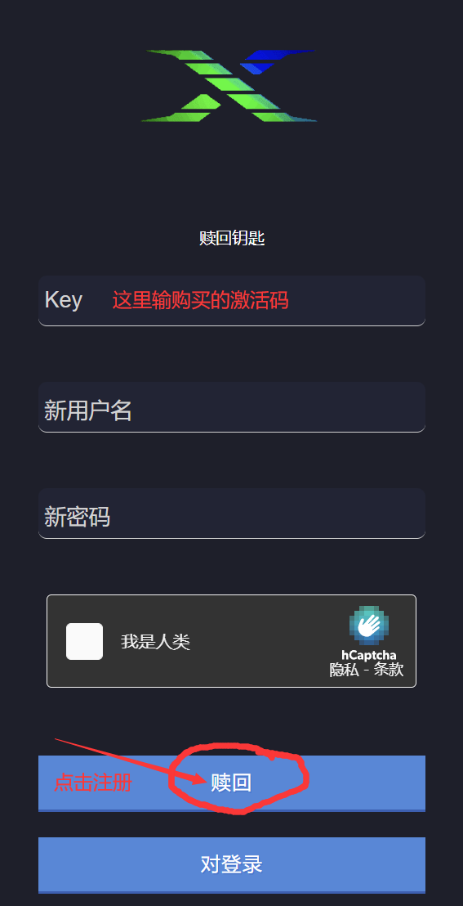

# 使用教程

访问注册链接：[https://dashboard.xforce.menu/redeem.php](https://dashboard.xforce.menu/redeem.php)

如下图为激活成功

.png>)

xf改不了密码，丢了找不回，自己保存好

在售后群中下载安装器选择xforce并输入账号密码

.png>)

先点击安装，进入故事模式后再点击注入

等待注入成功即可

.png>)

.png>)

出现短暂卡顿为正常现象

**`*` 呼出/隐藏菜单**

**小键盘`8`  `2` 控制上下**

**小键盘`4`  `6` 控制左右**

**小键盘`5` 确定； `0` 返回**

## **设置中文**

**呼出菜单，打开设置“**<mark style="color:purple;">**Settings**</mark>**”，翻译“**<mark style="color:purple;">**translations**</mark>**”，选择“**<mark style="color:purple;">**Chinese**</mark>**” 按5确定**
