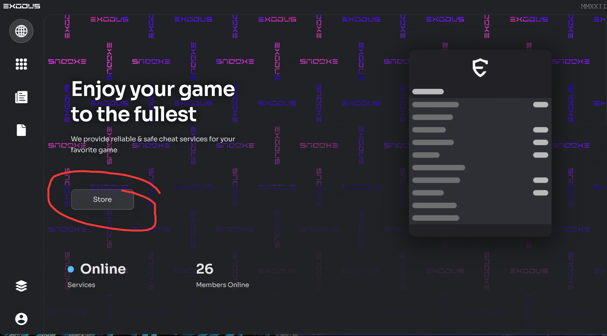
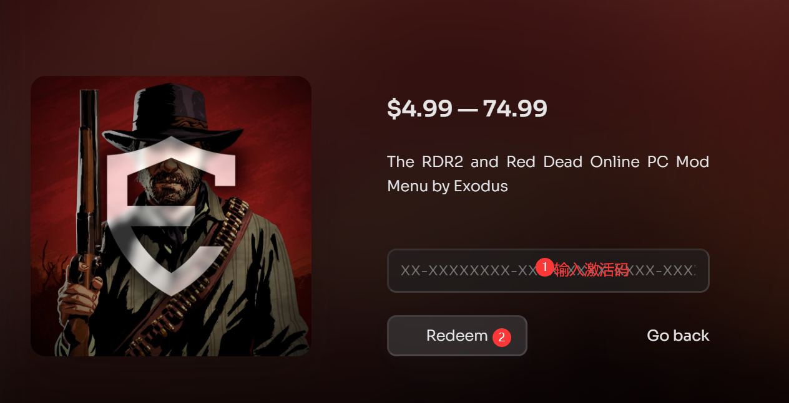

# 使用教程

## 注册激活

进入官网注册页面[https://exodusmenu.com/account/sign-up](https://exodusmenu.com/account/sign-up)

.png>)

点击sign up后会进入下图，然后点击store

## 下载

售后群下载安装器之后输入用户信息安装注入即可

## 使用

**`F3` 呼出/隐藏菜单**

**方向键`↑`  `↓` 控制上下**

**方向键`←`  `→` 控制左右**

**`回车键/Ent/` 确定； `退格键/Back/` 返回**

**`F12`设置快捷键**
