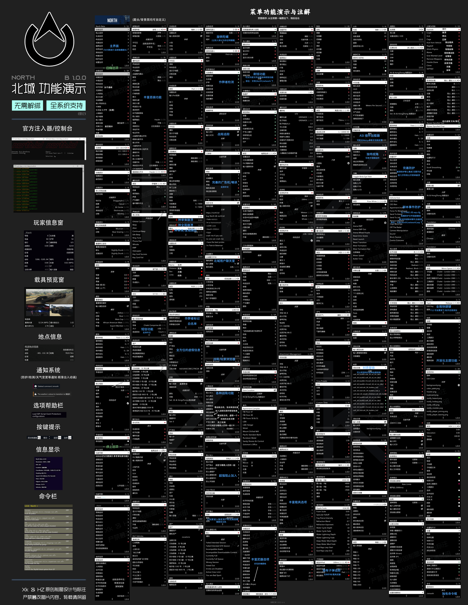

# North-北域

**支持win7/10/11，下线即解绑无冷却**

**可加载2Take1 sep.cfg 脚本事件 防护拓展**

**拥有Stand独家同款命令框功能,通过输入对应代码来形成功能**

**可通过外部刷钱配置来刷钱(一秒39000跟一秒10000等等,相对稳定)**

**可阻止作弊者追踪加入你的战局**

**拥有任务抢劫助手(小岛，赌场）**&#x20;

**拥有黑名单关键词管理器(将聊天、姓名、文本、短信列入黑名单,广告机噩梦）**

**拥有战局浏览器**

**高度自定义主题,支持全局GIF加载**

**具有完整抢战局主机功能 自定义 优先级！完整的主机工具箱功能 包括黑名单拦截**

**载具控制编辑器\[又名处理编辑器] 此功能及其完整**

**支持修改载具一切 \[后台数据!!!] 支持修改一切载具后台 \[子处理数据!!!]**

**载具后台数据 并不是改车王的升级**

**\[加速] \[制动] \[刹车] \[手刹] \[速度] \[最大速度] \[转向角度]**

**\[防御力] \[质量] \[灵活性] \[档位数量] \[升档速度] \[载具悬挂]**

**子处理数据包括 \[摩托车] \[MK2暴君] \[船] \[飞行器] \[飞机] \[直升机] \[喷气背包] \[坦克]**

********
