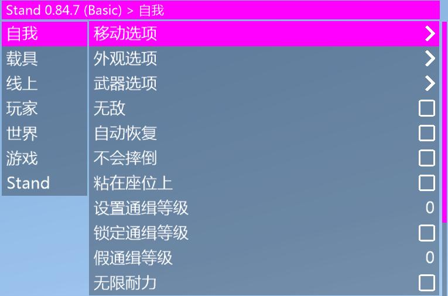
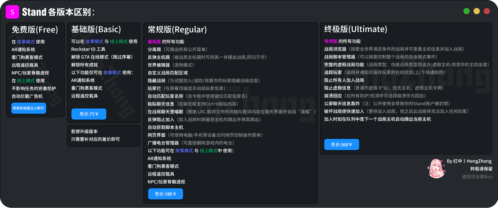

# Stand

**换机解绑时间:无冷却，下线自动解绑**

**支持Win10/Win11系统**

**注入最快且无后台黑框**

**自带基础功能非常多**

**并且拥有可调节高度自定义的功能参数**

**稳定任务，甚至可以开着防护做任务，可跳大多数差事的前置\[DC小岛设施任务……**

**单开优化好，多开兼容好(几乎可以跟任何菜单双开)**

**更好的ASI扩展功能脚本加载器\[可以自由扩展辅助没有的功]**

**ASI加载器是目前所有菜单当中顶级的**

**拥有LUA脚本引擎。可定制崩溃脚本等。**

**自定义功能\[优秀具备特色的Lua脚本]**

**高度自定义主题非常简单且花样多，能变成你喜欢的样子!\[例如动漫风]**

<figure><figcaption></figcaption></figure>

<figure><figcaption></figcaption></figure>

